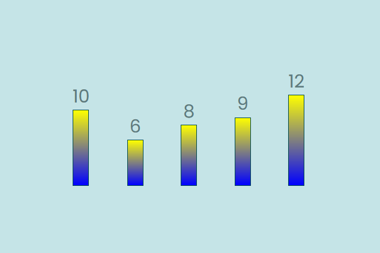

# React + Vite

This template provides a minimal setup to get React working in Vite with HMR and some ESLint rules.

Currently, two official plugins are available:

- [@vitejs/plugin-react](https://github.com/vitejs/vite-plugin-react/blob/main/packages/plugin-react/README.md) uses [Babel](https://babeljs.io/) for Fast Refresh
- [@vitejs/plugin-react-swc](https://github.com/vitejs/vite-plugin-react-swc) uses [SWC](https://swc.rs/) for Fast Refresh

## How to set up your development environment
1. Open the terminal in your VS code or open the git bash.
2. In the terminal, type `npm install`.
3. Boom! You are good to go. Please run the dev environment.

## How to Run the Dev Environment
1. Open the terminal in your VS code or open the git bash.
2. In the terminal, type `npm run dev`.
3. Click on the dev link seen in the terminal.
4. You are ready to see the timely refrehsed page in the dev environment whenever you save the codes!

### Screenshot

